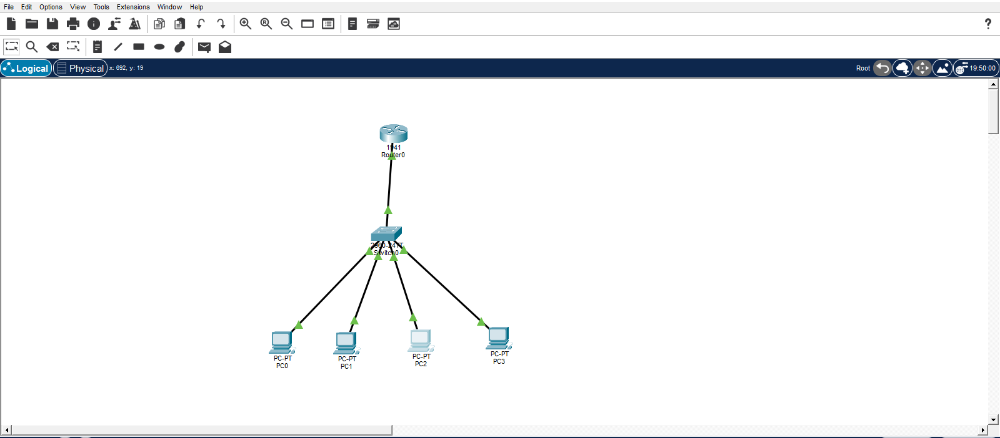
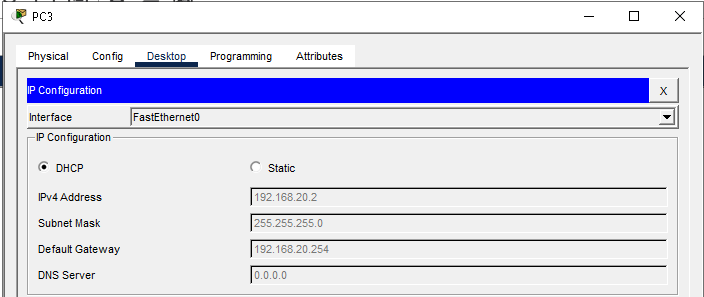
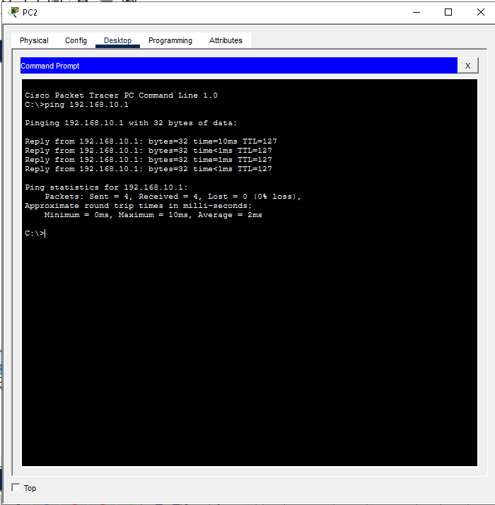

# DHCP for Multiple VLANs - Cisco Packet Tracer

## Objective

Designed dynamic IP address allocation for multiple VLANs using a Cisco router as a DHCP server while maintaining inter-VLAN routing.

## Network Design

* 1 Router
* 1 Switch
* 4 PCs
* VLAN 10 for HR
* VLAN 20 for IT

## Configuration Tasks

* Created VLAN 10 and VLAN 20 on the switch
* Assigned switch ports to the appropriate VLANs
* Configured trunking between the switch and router
* Configured router subinterfaces for inter-VLAN routing
* Created DHCP pools for each VLAN on the router
* Excluded gateway IP addresses from DHCP assignment
* Configured PCs to obtain IP addresses automatically via DHCP
* Verified communication between VLANs

## Results

* PCs automatically received IP addresses based on their VLAN
* Devices in different VLANs communicated successfully through the router
* New devices could be added to the network without manual IP configuration
* DHCP address allocation was verified through router bindings

## Technologies Used

* Cisco Packet Tracer
* VLAN Configuration
* 802.1Q Trunking
* Inter-VLAN Routing
* DHCP Configuration
* IP Addressing
* Network Troubleshooting

## Skills Demonstrated

* VLAN creation and management
* DHCP pool configuration
* Router subinterface configuration
* Trunk port configuration
* Dynamic IP allocation
* Network scalability
* Connectivity verification

## Screenshots

### Network Topology

### PC DHCP Assignment

### Connectivity Test

## Project File

* dhcp-multi-vlan-project.pkt

## Author

Kgothatso Seshoka
